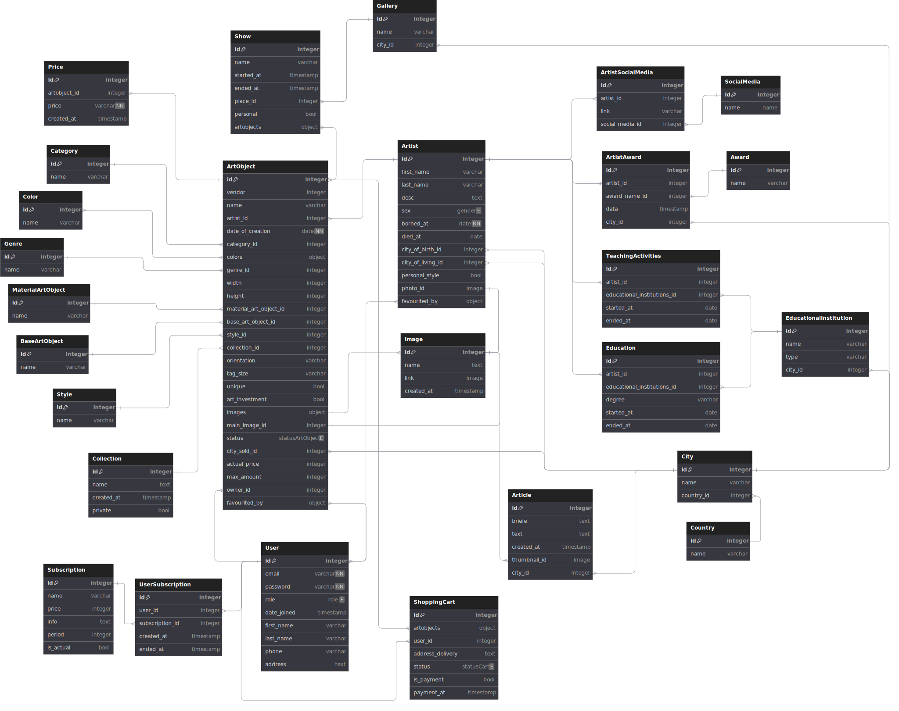
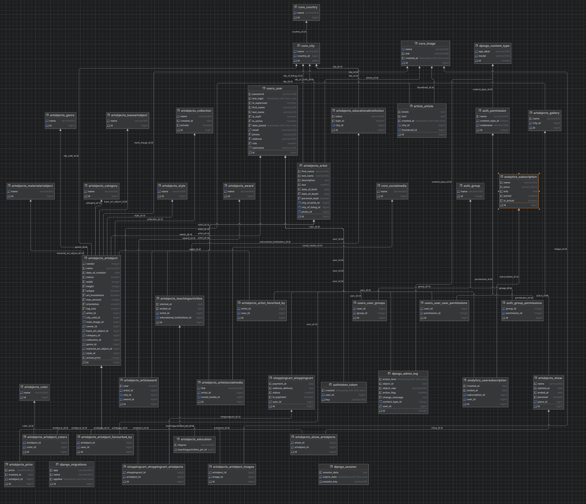

# API Șagaart
## Описание:

[Схема базы данных](https://dbdiagram.io/d/Sagaart-667036d9a179551be610c2af)   

### Модель данных:



### Схема БД:




**IP тестового сервера**: 158.160.171.226

**Redoc**: http://158.160.171.226/api/v1/redoc/

## Технологии:

[](https://skillicons.dev)

## Пользователи

### 1. Суперпользоаватель (вход в админку):

        email: aaa@host2011.com,
        password: alskdjfhg

## Возможности проета:

Добавление объекта и художника в избранное
Добавление объекта в корзину, оплата.
При создании объекта или изменении цены объекта, данные по цене заносятся в таблицу Price. 
Таким образом мы храним исторические данные по цене и можем выстраивать график изменения цены в динамике
на странице просмотра данных по картине "Аналитика стоимости".
Добавлены модели по подписке Subscription, UserSubscription. Это платная подписка на аналитику.
В аналитике собрать данные от пользователя и прогнать через программу заказчика, на выходе 
отдаем цену объекта.

## Что сделано:

Версионирование API

Тестовая БД с данными

1. **Пользователь**

* Регистрация: /api/v1/users/registration/ (**POST**): 
  (по емейлу и паролю)

**Пример запроса**
```
POST /api/v1/users/registration/
Права доступа: Доступно без токена.
Request:
{
    "email": "aaa@host2011.com",
    "password": "alskdjfhg"
}

Response:
{
    "message": "Успешная регистрация"
}
```

* Автризация: /api/v1/users/login/ (**POST**): 
используется для авторизации по емейлу и паролю, чтобы далее использовать токен при запросах. 

**Пример запроса**
```
POST api/auth/token/login/
Права доступа: Доступно без токена.
Request:
{
    "email": "aaa@host2011.com",
    "password": "alskdjfhg"
}

Response:
{
    "message": "Пользователь авторизован",
    "access_token": "string"
}
```

* /api/v1/users/update/{user_id}/ (**PUT**): 

**Пример запроса**
```
PUT /api/v1/users/update/{id}/
Права доступа: по токену.
Request:
{
    "first_name": "string",
    "last_name": "string", 
    "phone": "string", 
    "address": "string",
    "password": "string"
}

Response:
{
    "email": "aaa@host2011.com",
    "first_name": "string",
    "last_name": "string",
    "phone": "string",
    "address": "string"
}
```


2. **Артобъект**

* `api/v1/artobjects/` (**GET**): получить список всех артобъектов
* Фильтр по полям 'category', 'genre', 'style', 'orientation','tag_size', 'colors', 'artist' (id поля):
* Например `api/v1/artobjects/{id}/?category=1` (одно условие)
* Например `api/v1/artobjects/{id}/?genre=1&orientation=1` (выполняются оба условия)

**Пример запроса**

```
GET api/v1/artobjects/
Права доступа: Доступно без токена
Response:

[
    {
        "id": 1,
        "artist": {
            "id": 1,
            "first_name": "Вася",
            "last_name": "Васечкин"
        },
        "vendor": 123,
        "name": "Портрет",
        "status": "В продаже",
        "category": {
            "id": 1,
            "name": "живопись"
        },
        "colors": [
            {
                "id": 1,
                "name": "светлые оттенки"
            },
            {
                "id": 2,
                "name": "темные оттенки"
            }
        ],
        "genre": {
            "id": 1,
            "name": "портрет"
        },
        "width": 100,
        "height": 80,
        "material_art_object": {
            "id": 1,
            "name": "масло"
        },
        "base_art_object": {
            "id": 1,
            "name": "холст"
        },
        "style": {
            "id": 1,
            "name": "готика"
        },
        "main_image": null,
        "is_favourite": false,
        "orientation": "Горизонтальная",
        "tag_size": "до 100 см",
        "actual_price": 33333333
    }
]

``` 

* `api/v1/artobjects/{id}/` (**GET**): получить артобъект по id.

**Пример запроса**
``` 
GET api/v1/artobjects/{id}/
Права доступа: Доступно без токена.
Response:
{
    "id": 1,
    "owner": {
        "id": 1,
        "email": "aaa@host2011.com",
        "first_name": "",
        "last_name": "",
        "phone": null,
        "address": null
    },
    "artist": {
        "id": 1,
        "first_name": "Вася",
        "last_name": "Васечкин",
        "description": "что-то",
        "sex": "М",
        "date_of_birth": "2024-07-01",
        "date_of_death": "2024-07-01",
        "personal_style": false,
        "city_of_birth": {
            "id": 1,
            "name": "Москва",
            "country": {
                "id": 1,
                "name": "Россия"
            }
        },
        "city_of_living": {
            "id": 1,
            "name": "Москва",
            "country": {
                "id": 1,
                "name": "Россия"
            }
        },
        "photo": null,
        "is_favorite": false
    },
    "vendor": 123,
    "name": "Портрет",
    "date_of_creation": "2024-07-01",
    "status": "В продаже",
    "city_sold": {
        "id": 1,
        "name": "Москва",
        "country": {
            "id": 1,
            "name": "Россия"
        }
    },
    "category": {
        "id": 1,
        "name": "живопись"
    },
    "colors": [
        {
            "id": 1,
            "name": "светлые оттенки"
        },
        {
            "id": 2,
            "name": "темные оттенки"
        }
    ],
    "genre": {
        "id": 1,
        "name": "портрет"
    },
    "width": 100,
    "height": 80,
    "material_art_object": {
        "id": 1,
        "name": "масло"
    },
    "base_art_object": {
        "id": 1,
        "name": "холст"
    },
    "style": {
        "id": 1,
        "name": "готика"
    },
    "collection": null,
    "unique": true,
    "art_investment": true,
    "images": [],
    "main_image": null,
    "max_amount": 1,
    "is_favourite": false,
    "orientation": "Горизонтальная",
    "tag_size": "до 40 см",
    "actual_price": 33333333,
    "shows": [
        {
            "name": "Выставка-1",
            "started_at": "2024-07-01",
            "ended_at": "2024-07-02",
            "place": {
                "id": 1,
                "name": "Московская галлерея",
                "city": {
                    "id": 1,
                    "name": "Москва",
                    "country": {
                        "id": 1,
                        "name": "Россия"
                    }
                }
            },
            "personal": false
        },
        {
            "name": "Выставка-2",
            "started_at": "2024-05-01",
            "ended_at": "2024-05-03",
            "place": {
                "id": 1,
                "name": "Московская галлерея",
                "city": {
                    "id": 1,
                    "name": "Москва",
                    "country": {
                        "id": 1,
                        "name": "Россия"
                    }
                }
            },
            "personal": false
        }
    ]
}

``` 

3. **Художники**

* `api/v1/artists/` (**GET**): получить список всех артобъектов

**Пример запроса**

```
GET api/v1/artists/
Права доступа: Доступно без токена
artobjects отдается один объект (произвольный) 
Response:

[
    {
        "id": 1,
        "first_name": "Елисей",
        "last_name": "Авдеев",
        "city_of_living": {
            "id": 6,
            "name": "Минск",
            "country": {
                "id": 4,
                "name": "Белорусь"
            }
        },
        "artobjects": {
            "id": 54,
            "vendor": 198808,
            "name": "Близко левый торопливый.",
            "status": 3,
            "category": {
                "id": 1,
                "name": "живопись"
            },
            "colors": [],
            "genre": {
                "id": 1,
                "name": "портрет"
            },
            "width": 650,
            "height": 527,
            "material_art_object": {
                "id": 2,
                "name": "акварель"
            },
            "base_art_object": {
                "id": 5,
                "name": "фотобумага"
            },
            "style": {
                "id": 10,
                "name": "сюрреализм"
            },
            "main_image": null,
            "orientation": 2,
            "tag_size": 2,
            "actual_price": null
        },
        "is_favorite": false,
        "photo": {
            "id": 128,
            "name": "Художник Авдеев",
            "link": "http://158.160.171.226/media/http%3A/oao.ru/",
            "created_at": "2024-07-02T20:49:21.413098Z"
        }
    },
]

``` 

* `api/v1/artobjects/{id}/` (**GET**): получить артобъект по id.

**Пример запроса**
``` 
GET api/v1/artobjects/{id}/
Права доступа: Доступно без токена.
artobjects отдаются все работы художника
Response:
{
    "id": 1,
    "first_name": "Ян",
    "last_name": "Пестов",
    "description": "Фонарик нажать ...",
    "sex": 1,
    "date_of_birth": "1948-06-06",
    "date_of_death": null,
    "personal_style": false,
    "city_of_birth": {
        "id": 5,
        "name": "Рим",
        "country": {
            "id": 3,
            "name": "Италия"
        }
    },
    "city_of_living": {
        "id": 3,
        "name": "Сочи",
        "country": {
            "id": 1,
            "name": "Россия"
        }
    },
    "photo": {
        "id": 81,
        "name": "Фото художника",
        "link": "http://158.160.171.226/media/http%3A/www.kamaz.org/",
        "created_at": "2024-07-02T20:49:09.878880Z"
    },
    "artobjects": [
        {
            "id": 1,
            "vendor": 797961,
            "name": "Картинка передо темнеть.",
            "status": 3,
            "category": {
                "id": 3,
                "name": "фотография"
            },
            "colors": [],
            "genre": {
                "id": 7,
                "name": "анималистика"
            },
            "width": 227,
            "height": 409,
            "material_art_object": {
                "id": 3,
                "name": "акрил"
            },
            "base_art_object": {
                "id": 2,
                "name": "картон"
            },
            "style": {
                "id": 7,
                "name": "импрессионизм"
            },
            "main_image": null,
            "orientation": 1,
            "tag_size": 1,
            "actual_price": null
        },
        {
            "id": 4,
            "vendor": 729308,
            "name": "Плясать мелькнуть мелочь цель.",
            "status": 1,
            "category": {
                "id": 3,
                "name": "фотография"
            },
            "colors": [],
            "genre": {
                "id": 7,
                "name": "анималистика"
            },
            "width": 580,
            "height": 135,
            "material_art_object": {
                "id": 2,
                "name": "акварель"
            },
            "base_art_object": {
                "id": 3,
                "name": "бумага"
            },
            "style": {
                "id": 18,
                "name": "стрит-арт"
            },
            "main_image": null,
            "orientation": 1,
            "tag_size": 4,
            "actual_price": null
        },
        {
            "id": 2,
            "vendor": 83636,
            "name": "Постоянный войти упор.",
            "status": 2,
            "category": {
                "id": 1,
                "name": "живопись"
            },
            "colors": [],
            "genre": {
                "id": 4,
                "name": "марина"
            },
            "width": 236,
            "height": 50,
            "material_art_object": {
                "id": 6,
                "name": "офорт"
            },
            "base_art_object": {
                "id": 5,
                "name": "фотобумага"
            },
            "style": {
                "id": 6,
                "name": "классицизм"
            },
            "main_image": null,
            "orientation": 2,
            "tag_size": 2,
            "actual_price": null
        },
        {
            "id": 5,
            "vendor": 748884,
            "name": "Присесть некоторый прошептать.",
            "status": 1,
            "category": {
                "id": 2,
                "name": "графика"
            },
            "colors": [],
            "genre": {
                "id": 3,
                "name": "натюрморт"
            },
            "width": 151,
            "height": 605,
            "material_art_object": {
                "id": 7,
                "name": "чернила"
            },
            "base_art_object": {
                "id": 3,
                "name": "бумага"
            },
            "style": {
                "id": 16,
                "name": "конструктивизм"
            },
            "main_image": null,
            "orientation": 2,
            "tag_size": 4,
            "actual_price": null
        },
        {
            "id": 3,
            "vendor": 506354,
            "name": "Скользить настать призыв.",
            "status": 1,
            "category": {
                "id": 4,
                "name": "digital"
            },
            "colors": [],
            "genre": {
                "id": 8,
                "name": "ню"
            },
            "width": 738,
            "height": 799,
            "material_art_object": {
                "id": 2,
                "name": "акварель"
            },
            "base_art_object": {
                "id": 4,
                "name": "дерево"
            },
            "style": {
                "id": 12,
                "name": "романтизм"
            },
            "main_image": null,
            "orientation": 2,
            "tag_size": 2,
            "actual_price": null
        }
    ],
    "is_favorite": false,
    "shows": [
        {
            "name": "Выставка Вторая",
            "started_at": "2024-07-01",
            "ended_at": "2024-07-02",
            "place": {
                "id": 3,
                "name": "Свиное рыло",
                "city": {
                    "id": 2,
                    "name": "Санкт-Петербург",
                    "country": {
                        "id": 1,
                        "name": "Россия"
                    }
                }
            },
            "personal": false
        }
    ],
    "awards": [
        {
            "award": {
                "id": 3,
                "name": "Нереальное реальное"
            },
            "year": 2005,
            "city": {
                "id": 2,
                "name": "Санкт-Петербург",
                "country": {
                    "id": 1,
                    "name": "Россия"
                }
            }
        }
    ],
    "education": [
        {
            "degree": "Магистр",
            "ended_at": "2007-11-01",
            "educational_institutions": {
                "id": 1,
                "name": "Санкт-Петербургский государственный академический институт живоп",
                "type_ei": 1,
                "city": 2
            }
        }
    ]
}

``` 

4. **Новостные статьи**

* `api/v1/articles/` (**GET**): получить список всех новостных статей

**Пример запроса**

```
GET api/v1/artists/
Права доступа: Доступно без токена
Response:

[
    {
        "id": 1,
        "name": "Ринат Ахметов Луна, которая хотела стать солнцем"
        "city": {
            "id": 1,
            "name": "Москва",
            "country": {
                "id": 1,
                "name": "Россия"
            }
        },
        "thumbnail": {
            "id": 1,
            "name": "Вряд ягода светило анализ хлеб.",
            "link": "/media/http%3A/rao.edu/",
            "created_at": "03.07.2024 08:59:18"
        },
        "briefe": "Музей современного искусства Эрарта представил выставку художника Рината Ахметова, который создает удивительные картины мира, сочетая металл, дерево, эмаль и масло. Философский проект, в котором автор предлагает зрителю вырваться из потока времени и поразмышлять о вечном",
        "text": "Музей современного искусства Эрарта представил выставку ...",
        "created_at": "03.07.2024 08:59:18"
    }
]

``` 

* `api/v1/articles/{id}/` (**GET**): получить новость по id.

**Пример запроса**
``` 
GET api/v1/articles/{id}/
Права доступа: Доступно без токена.
Response:
{
    "id": 1,
    "name": "Ринат Ахметов Луна, которая хотела стать солнцем"
    "city": {
        "id": 1,
        "name": "Москва",
        "country": {
            "id": 1,
            "name": "Россия"
        }
    },
    "thumbnail": {
        "id": 1,
        "name": "Вряд ягода светило анализ хлеб.",
        "link": "/media/http%3A/rao.edu/",
        "created_at": "03.07.2024 08:59:18"
    },
    "briefe": "Музей современного искусства Эрарта представил выставку художника Рината Ахметова, который создает удивительные картины мира, сочетая металл, дерево, эмаль и масло. Философский проект, в котором автор предлагает зрителю вырваться из потока времени и поразмышлять о вечном",
    "text": "Музей современного искусства Эрарта представил выставку ...",
    "created_at": "03.07.2024 08:59:18"
}

``` 
5. **Справочники**

* `api/v1/awards/` (**GET**): получить список всех наград
* `api/v1/bases/` (**GET**): получить список всех основ артобъекта
* `api/v1/categories/` (**GET**): получить список всех категорий
* `api/v1/colors/` (**GET**): получить список всех цветовых гамм
* `api/v1/genres/` (**GET**): получить список всех жанров
* `api/v1/materials/` (**GET**): получить список всех материалов
* `api/v1/socialmedias/` (**GET**): получить список всех социальных сетей
* `api/v1/style/` (**GET**): получить список всех стилей

**Пример запроса**

```
GET api/v1/awards/
Права доступа: Доступно без токена
Response:
[
    {
        "id": 1,
        "name": "Лучший",
    }
]
``` 

* `api/v1/awards/{id}/` (**GET**): получить награду по id.
* `api/v1/bases/{id}/` (**GET**): получить основу артобъекта по id.
* `api/v1/categories/{id}/` (**GET**): получить категорию по id.
* `api/v1/colors/{id}/` (**GET**): получить цветовую гамму по id.
* `api/v1/genres/{id}/` (**GET**): получить жанр по id.
* `api/v1/materials/{id}/` (**GET**): получить материал по id.
* `api/v1/socialmedias/{id}/` (**GET**): получить социальную сетей по id.
* `api/v1/style/{id}/` (**GET**): получить стиль по id.

**Пример запроса**
``` 
GET api/v1/awards/{id}/
Права доступа: Доступно без токена.
Response:
{
    "id": 1,
    "name": "Лучший",
}
``` 
4. **Справочник городов (упрощенный вариант справочника адресов)**

* `api/v1/cities/` (**GET**): получить список всех городов

```
GET api/v1/awards/
Права доступа: Доступно без токена
Response:
[
    {
        "id": 6,
        "name": "Минск",
        "country": {
            "id": 4,
            "name": "Белорусь"
        }
    }
]
``` 

* `api/v1/cities/{id}/` (**GET**): получить город по id

**Пример запроса**
``` 
GET api/v1/awards/{id}/
Права доступа: Доступно без токена.
Response:
{
    "id": 6,
    "name": "Минск",
    "country": {
        "id": 4,
        "name": "Белорусь"
    }
}
``` 


## Работа с Github в команде

Разработка ведется в ветке **develop**


**1. Перейти в ветку develop:**

```
git checkout develop
```

**2. Создать свою ветку для разработки feature и сразу в нее перейти, название ветки <name>/<name_feature>**

```
git checkout -b <name>/<name_feature> 
```

**3. Когда разработка feature закончена, то перед тем как делать запрос на сливание своей ветки в develop проделать следующее:**

   - проверить в какой ветке находитесь:

```
git branch #  Проверили: "Где я?"
* <name>/<name_feature>  # Звездочка указывает в какой вы ветке
master 
develop
```
 - если не в своей ветке, то перейти в нее:

```
 git checkout <name>/<name_feature> 
```
 - если в своей, то все закомитить;
 - затем актуализировать свою ветку по последним изменениям из develop и решить конфликты, если есть:

```
 git rebase develop
```

 - затем отправить свою ветку в git (push).

**4. Перейти на GitHub и сделать “Pull requests” своей feature в ветку develop**

**5. После этого остальных членов команды назначить Reviewer:**
   - если не согласны, то добавляют комменарии;
   - если согласны, то выставляют статус “Approve”.

**6. Когда получены апрувы от всех членов команды, (!)владелец ветки делает “Merge pull request"**


## Запуск среды разработки

### 1. Клонировать docker_wrapper

```
git clone git@github.com:Sagaart-wold/docker-wrapper.git -b development docker-wrapper 
```
или
```
git clone https://github.com/Sagaart-wold/docker-wrapper.git
```


### 2. В папку 'docker_wrapper' склонировать backend

```
git clone git@github.com:Sagaart-wold/backend.git -b develop backend
```
или
```
git clone https://github.com/Sagaart-wold/backend.git -b develop backend
```

### 3. В папку 'docker_wrapper' склонировать frontend

```
git clone git@github.com:Sagaart-wold/frontend.git -b develop frontend
```
или
```
git clone https://github.com/Sagaart-wold/frontend.git -b develop frontend 
```

### 4.  Скопируйте все из файла .env.example в файл .env и актуализируйте данные по необходимости

### 5. В папке 'docker_wrapper' запустить docker-compose.yml:

```
docker-compose up -d
```

### 6. Остановить:

```
docker-compose down
```

### 7. Пересобрать

```
docker-compose build --no-cache --pull
```


## Авторы:  

[Елена](https://github.com/Edelveisx)  

[Виктор](https://github.com/Badmajor)

[Леонид](https://github.com/iceeleoo)

